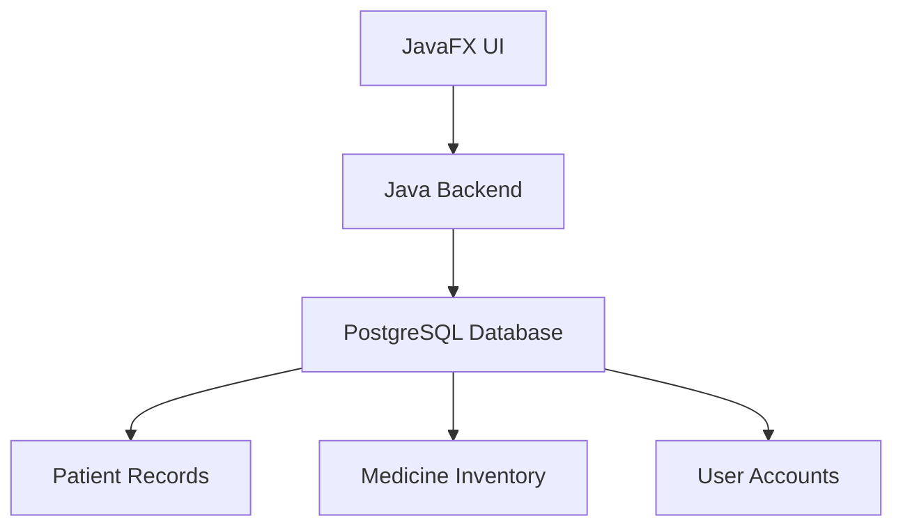

# Patient Care Center - Medical Management System  

  
*A comprehensive JavaFX application for healthcare management with PostgreSQL backend*

---

## 🌟 **Key Features**

### 👥 **Patient Management**
- **Complete Demographics**:
  - Name, DOB, gender, marital status
  - Nationality and language preferences
  - Contact details management
  


- **Search & Filter**:
  - Quick access to patient records
  - Action buttons for editing/viewing

### 💊 **Pharmacy & Prescriptions**
- **Smart Prescription System**:
  - Medicine selection from stock
  - Dosage calculation (frequency, duration)
  - Print/Send prescriptions
  


- **Inventory Management**:
  - Stock level indicators (e.g., "VERY HIGH")
  - Expiry date tracking (e.g., RED means Expired,YELLOW - 3 months to expire)
  


### 📄 **Medical Documentation**
- **Certificate Generation**:
  - Medical certificates
  - Fitness certificates
  - Ultrasound reports
  

### 🔐 **Security & Administration**
- **Role-based Access**:
  - Doctor/staff accounts
  - Secure authentication
  .png)

---

## 🖥️ **UI Components**

| Module | Screenshot |
|--------|------------|
| **Dashboard** | .png) |
| **Patient Registration** | .png) |
| **Prescription** | .png) |
| **Settings** | .png) |

---

## 🛠️ **Technical Architecture**



**Tech Stack**:
- Frontend: JavaFX 17+
- Backend: Java 17 (Spring Boot)
- Database: PostgreSQL 14
- Build: Maven

---

## 🚀 **Getting Started**

### Prerequisites
- Java JDK 17+
- PostgreSQL 14+
- JavaFX SDK

### Installation
```bash
git clone https://github.com/AdithyaWijewickrama/patient-care-center.git
cd patient-care-center
mvn clean install
```

### Configuration
1. Create PostgreSQL database
2. Update `application.properties`:
   ```properties
   spring.datasource.url=jdbc:postgresql://localhost:5432/pccdb
   spring.datasource.username=admin
   spring.datasource.password=secure123
   ```

---

## 📜 **License**
MIT License © 2025 Adithya Wijewickrama

---

## ✨ **Why Choose This System?**
- **Complete Solution**: From patient registration to pharmacy management
- **User-Friendly**: Intuitive JavaFX interface
- **Reliable**: PostgreSQL-backed data storage
- **Customizable**: Modular design for clinic-specific needs

**GitHub**: [github.com/your-repo](https://github.com/your-repo)  
**Demo**: [Insert Demo Link]  

---

Let me know if you'd like to add any additional sections like contribution guidelines or API documentation!
